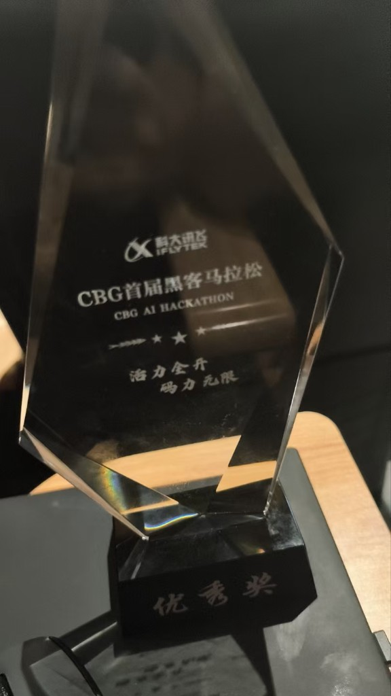
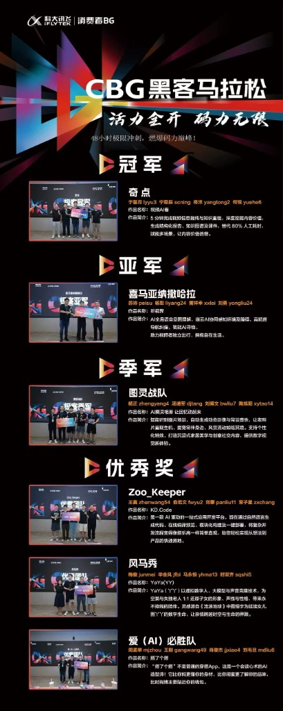

<section className="mb-2">
        <h2 className="text-2xl font-semibold text-blue-700">
          开源项目及竞赛经历
        </h2>
        

        

          <h4 className="font-bold text-blue-800">
            自变量机器人 | AI 推理服务
          </h4>
          <h4 className="font-bold">
            Embodied Inference Serving（https://x2robot.com/）
          </h4>
          <ul className="ml-4">
            <li className="list-[circle] list-item ">
              面向具身智能场景建设推理服务：服务链路、运行时与离线交付。
            </li>
            <li className="list-[circle] list-item">
              关注稳定性与可运维性，以及端侧与推理机之间的协同。
            </li>
          </ul>
          <h4 className="font-bold text-blue-800">
            科大讯飞 | Agent 工具调用 · 对话 · 评测 · 微调蒸馏
          </h4>
          <h4 className="font-bold">
            Agent 工具调用与多轮对话
          </h4>
          <ul className="ml-4">
            <li className="list-[circle] list-item ">
              负责 Agent 工具调用链路（Function Calling / Tool Use）：工具选择、参数填充、结果回填、失败重试。
            </li>
            <li className="list-[circle] list-item">
              搭建多轮对话：意图理解、上下文管理、工具编排与任务闭环。
            </li>
          </ul>
          <h4 className="font-bold">
            Agent 评测
          </h4>
          <ul className="ml-4">
            <li className="list-[circle] list-item ">
              建设评测：工具调用准确率、参数合法性、对话任务完成率与回归集。
            </li>
            <li className="list-[circle] list-item">
              用评测反推 Prompt / 工具描述 / 模型选择，把对话和工具调用做成可回归能力。
            </li>
          </ul>
          <h4 className="font-bold">
            微调与蒸馏
          </h4>
          <ul className="ml-4">
            <li className="list-[circle] list-item ">
              参与业务模型微调（SFT）与蒸馏，把大模型的工具调用和对话能力压到可上线小模型。
            </li>
            <li className="list-[circle] list-item">
              面向 Agent 场景做数据构造与能力对齐，服务端侧时延与成本约束。
            </li>
          </ul>
          <h4 className="font-bold text-blue-800">
            华为 | 项目经历
          </h4>
          <ul className="ml-4">
            <li className="list-[circle] list-item ">
              参与华为相关工程研发与项目落地。
            </li>
          </ul>
          <h4 className="font-bold text-blue-800">
            科大讯飞 CBG 首届黑客马拉松 | 优秀奖
          </h4>
          <h4 className="font-bold">
            爱(AI)必胜队 · 搭了个搭
          </h4>
          <ul className="ml-4">
            <li className="list-[circle] list-item ">
              48 小时黑客松：AI 穿搭助手，按体型、风格与预算给出个性化搭配。
            </li>
            <li className="list-[circle] list-item">
              队员：周孟萃、王刚、肖俊杰、刘毛旦。作品定位为「读心穿搭师」。
            </li>
          </ul>
          <h4 className="font-bold text-blue-800">
            个人开源
          </h4>
          <h4 className="font-bold">
            llm-from-scratch（https://github.com/xiaojunjie222/llm-from-scratch）
          </h4>
          <ul className="ml-4">
            <li className="list-[circle] list-item ">
              从零手写 Transformer，支持思维链推理。
            </li>
          </ul>
          <h4 className="font-bold">
            llm-quantization-toolkit（https://github.com/xiaojunjie222/llm-quantization-toolkit）
          </h4>
          <ul className="ml-4">
            <li className="list-[circle] list-item ">
              面向 Qwen / DeepSeek / LLaMA 的量化工具包。
            </li>
          </ul>
          <h4 className="font-bold">
            rbac-permission-system-java（https://github.com/xiaojunjie222/rbac-permission-system-java）
          </h4>
          <ul className="ml-4">
            <li className="list-[circle] list-item ">
              Spring Boot + MyBatis-Plus + JWT 权限系统。
            </li>
          </ul>
          
            <strong>
              做 Agent 不只写对话，把工具调用、评测、微调蒸馏和推理服务串成一条能上线的链路。活跃在科大讯飞 Agent 与自变量具身推理方向。
            </strong>
            <strong>详细经历：</strong>
            <a
              href="https://github.com/xiaojunjie222/xiaojunjie222/blob/main/iflytek.md"
              className="underline text-blue-600"
            >
              讯飞 Agent
            </a>
            ·
            <a
              href="https://github.com/xiaojunjie222/xiaojunjie222/blob/main/x2robot.md"
              className="underline text-blue-600"
            >
              自变量推理
            </a>
            <strong> 所有证书：</strong>
            <a
              href="https://github.com/xiaojunjie222/xiaojunjie222/blob/main/Awards.md"
              className="underline text-blue-600"
            >
              https://github.com/xiaojunjie222/xiaojunjie222/blob/main/Awards.md
            </a>
          
        

 </section>

