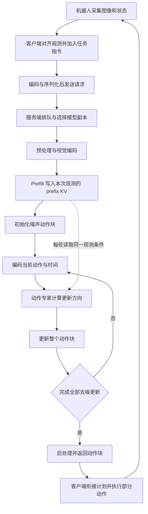
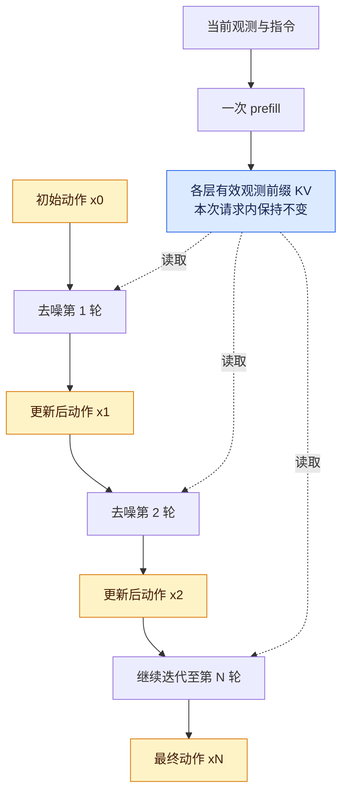
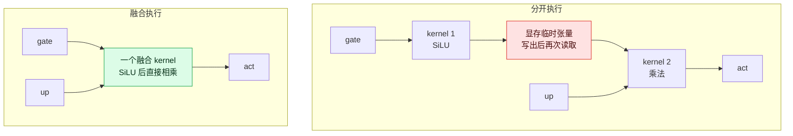
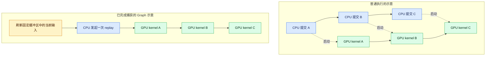
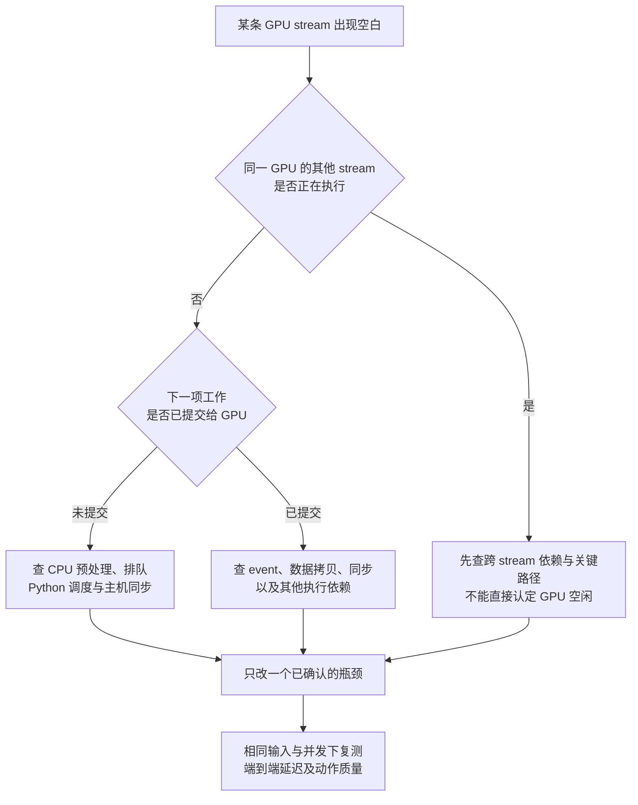

# Harrix 机器人推理优化详解

Harrix 将通用模型的执行组织成机器人动作生成路径。理解它的优化，可以沿一条主线展开：**当前观测先形成固定条件，动作专家在这个条件下反复更新整块动作，客户端再将新计划接入执行。**

这条链路的成本既来自模型计算，也来自请求等待、数据搬运、临时分配和 CPU 提交。优化目标是更早得到质量合格、能够衔接执行的动作；吞吐、单请求延迟与动作质量需要分别衡量。

本文以 Qwen2.5 优化路径为主。Qwen3.5 的整段动作循环 Graph、VGA-MoT 的会话历史属于其他模型族或后端，单独说明适用范围。代码块是原理示意，具体实现入口见文末。

阅读顺序是：先看全链路和张量变化，再看每次请求之前的初始化，随后沿客户端、prefill、denoise、算子与 Graph 深入，最后看计划衔接和性能验证。

## 一 从观测到动作的完整链路



一次请求中的 prefill 通常只执行一次，denoise 则执行 `N` 次。下一次观测请求到来后，图像和状态已经变化，通常会重新计算前缀；能够跨请求复用的结构与缓冲区另行管理。

### 每一步的数据与形状

用 `B` 表示 batch 大小，`P` 表示观测前缀 token 数，`H` 表示动作块长度，`D` 表示每个动作的维度，`N` 表示去噪更新次数。`L_p`、`L_a` 分别表示观测和动作专家的有效隐藏维度；`h_kv` 是 KV head 数，`d_h` 是每个 head 的维度。

| 步骤 | 主要数据及逻辑形状 | 此时发生的变化 |
| --- | --- | --- |
| 采集与对齐 | 多相机图像、机器人状态、任务指令 | 当前时刻产生新的观测；原始图像布局由客户端协议决定 |
| 编码与预处理 | 图像像素或压缩字节、token IDs、状态向量 | 传输表示变为模型可处理的数据 |
| 前缀构造 | 观测 embedding `[B,P,L_p]` | 当前图像、指令等条件转为前缀 token 表示；具体组成取决于模型 |
| Prefill | 每层前缀 K、V 各为 `[B,P,h_kv,d_h]` | 计算当前请求的条件缓存；实际存储还包含 padding 和容量预留 |
| 动作初始化 | `x_0` 为 `[B,H,D]` | 创建待生成的整个动作块，通常从噪声开始 |
| 第 i 轮动作编码 | `x_i` 与 `t_i` → 动作表示，逻辑上 `[B,H,L_a]` | 数值随动作和时间变化；实现可使用更宽的 padding 容器 |
| 第 i 轮动作专家 | 动作 Q/K/V 与固定 prefix KV | 重新计算当前动作的 attention 和 MLP，读取相同的观测条件 |
| 第 i 轮动作输出 | `v_i` 为 `[B,H,D]` | 输出更新方向，或由终点预测转换为更新方向 |
| Euler 更新 | `x_{i+1}=x_i+dt_i*v_i` | 整个动作块数值更新，形状仍是 `[B,H,D]` |
| 后处理与执行 | 最终动作块 `[B,H,D]` | 转回机器人所需的尺度和坐标约定，再执行其中一段 |

这里给出的是逻辑形状。`L_a` 表示动作专家的有效输入宽度，不等于 Q 投影宽度或所有残差缓冲区的宽度；部分中间容器仍保留 padding。共享 prefix KV 的路径还要求读写两端的 KV head 布局兼容。状态向量放在前缀还是动作条件中，应跟随相应模型的 token 布局。

## 二 初始化阶段准备专用执行路径

初始化通常发生在服务启动、模型加载或重新配置时，需要与每次请求的稳定运行耗时分开。

### 服务对象与职责

服务组件按职责拆开后，可以分别定位网络、预处理和模型计算的耗时。

| 对象或组件 | 主要职责 |
| --- | --- |
| 客户端 | 采集和对齐观测、提交请求、管理动作队列与执行节奏 |
| Router | 在可用模型副本之间选择请求去向 |
| Worker 或 Replica | 持有模型实例、GPU 上下文及本地执行状态 |
| ServingPolicy 和请求适配器 | 处理协议、会话身份及模型请求转换 |
| ModelExecutor | 组织预处理、引擎执行和后处理 |
| Engine | 执行具体模型族、精度和后端对应的推理路径 |
| 有状态模型 policy | 为某个会话维护历史窗口、推进状态和计数器 |

这些对象不一定一一对应独立进程。还要区分三个层次：一个 GPU 上可以运行多个 worker；一个 worker 可以保存多个会话的 policy；多个会话的 policy 可以共享模型权重，但分别持有自己的历史状态。

### 固定观测专家与动作专家

通用模型可能通过 token 类型选择观测专家和动作专家。动作生成时，两类计算的职责很明确：观测前缀在本轮生成期间保持不变，动作部分反复变化。

在已阅读的 Qwen2.5 优化路径中，构建阶段分别固定专家，形成专用模型：

```python
# 概念示意
prefill_model = build_model(expert_index=0)
action_model = build_model(expert_index=1)
```

这样可以减少运行时的通用路由和无关处理，也便于独立组织权重布局与算子。

动作专家的较小隐藏维度来自模型设计和训练配置；执行引擎负责按该结构高效计算，不能把它描述为推理时临时把大模型压缩成小模型。还应检查实际 GEMM 使用的有效维度，以及为接口兼容保留的 padding 是否继续造成额外开销。

### 权重存储和加载峰值

模型加载时的临时副本，可能让峰值显存明显高于最终运行状态。对使用 BF16 的推理路径，可以先在 CPU 转换参数类型，再将参数搬到 GPU：

```python
# 概念示意
model.to(dtype=torch.bfloat16)  # 此时模型仍在 CPU
model.to(device="cuda")
```

在相同参数数量下，BF16 参数存储大小约为 FP32 的一半；这不意味着总显存也减半，因为还存在 KV、激活、工作空间及分配器保留内存。

如果优化模型已经替代基础 decoder，还可以回收不再使用的基础权重，避免两套表示同时常驻。前提是剩余执行路径和回退逻辑不再依赖被释放的层。

预先保留 `weight.t()` 一类转置视图，则是减少重复准备的一种方式。PyTorch 的二维转置通常改变 shape 和 stride，并不必然执行一次物理数据搬运；后续 GEMM 是否额外整理布局，需要看实际 kernel 和 trace。[PyTorch 转置说明](https://docs.pytorch.org/docs/stable/generated/torch.transpose.html)

## 三 客户端准备请求并送到 GPU

### 观测与传输

一次请求通常包含当前图像、机器人状态、语言指令和协议元信息。启用 RTC 时，还可能携带旧动作计划的前缀及相应的延迟信息。普通动作生成路径中的初始噪声通常由推理端准备。

传输中的几个概念需要分开：JPEG 压缩图像，Base64 将二进制转换成文本，MsgPack 将结构化数据序列化为二进制；它们本身都不是加密。传输加密取决于 TLS 等实际部署方式。[MessagePack 官方说明](https://msgpack.org/index.html)

### 请求调度与模型副本

系统层首先决定 GPU 有没有及时拿到工作，以及请求在 GPU 之外等待了多久。

常见手段包括连接复用、非阻塞请求队列、受控的动态合批、多个模型副本，以及有条件地重叠 CPU 准备、数据传输和 GPU 执行。Harrix 的服务框架提供了相关调度边界，具体后端是否支持合批、异步执行和流水重叠，需要逐条确认。

动态合批把兼容请求合成一个 batch，可能提高 GPU 效率，也会引入等待其他请求的时间。机器人场景应同时观察 batch 大小、最大等待时间、队列长度和动作截止时间。

多 GPU 服务中的一种常见结构是：每张卡持有完整模型副本，router 把不同请求分给不同副本。这属于服务层的数据并行；张量并行则把一次模型计算切到多张卡，并引入卡间通信。看到多个 worker，不能据此认定使用了张量并行。

有状态模型还要求会话连续性。历史保存在某个 worker 的内存里时，相同 `session_key` 的后续请求需要回到相应副本，或通过专门机制迁移状态。只固定模型版本，不能保证拿到上一轮历史。

## 四 视觉编码与观测前缀缓存

### 图像内容重算，稳定结构复用

相机数量、图像尺寸、patch 布局和位置编码规则稳定时，部分准备工作可以复用，例如 padding 元信息、位置索引、mask 结构和固定形状缓冲区。

图像内容仍随新观测变化，图像 embedding 也需要更新。形状相同不代表内容相同，不能因为两张图都是相同分辨率，就复用上一张图的视觉结果。

缓存键需要覆盖真正影响结果的条件。对于多模态网格，除了 shape，还可能涉及实际 `grid_thw` 内容、预处理配置、位置规则和模型版本。只按 shape 判断有效性，可能在输入布局变化时错误命中。

视觉链路的成本还包括解码、resize、布局转换、归一化和 CPU 到 GPU 的复制。采用 JPEG bytes、raw 或 NV12 等传输方式时，应比较整条链路的网络字节数与编解码成本，不能仅根据某一步更快就决定方案。

### Prefill 计算本次请求的条件

同一次请求中，观测、指令和相应前缀表示保持不变。只要前缀不读取正在变化的动作 token，且本请求内前缀条件、位置规则和权重保持不变，就可以先计算前缀 K/V，后续去噪仅重算动作部分并读取前缀缓存。KV 缓存复用的前提是相应历史表示保持有效。[Hugging Face 缓存原理](https://huggingface.co/docs/transformers/main/en/cache_explanation)

| 数据 | 同一请求的不同去噪轮次 | 下一次新观测请求 |
| --- | --- | --- |
| 观测 embedding 和 prefix KV | 复用 | 通常重新计算 |
| 当前动作 `x_t` | 更新 | 重新初始化或按策略准备 |
| 当前动作的 K/V | 重新计算 | 重新计算 |
| 时间 `t` 和更新量 `v_t` | 随迭代变化 | 重新准备 |
| mask 与位置等结构 | 满足缓存条件时复用 | 满足缓存条件时复用 |

这里缓存的是观测条件的各层 K/V，不是已经预测好的最终动作。当前动作块在每轮被改进，不能把每轮动作 K/V 都追加为新的历史。

Harrix 的进一步优化包括预分配连续 KV 存储、按层取视图，以及复用长度和 padding 元信息。一种逻辑布局可以写为：

```text
[K/V, 层数, 最大 batch, 最大序列长度, KV heads, head dimension]
```

它减少动态分配，也为固定地址的 CUDA Graph 执行创造条件；代价是容量必须预先规划，并明确处理超出上限的输入。

普通实现本来也可以缓存 prefix KV。这里要区分“使用 KV cache”与“把缓存布局和执行路径进一步专用化”。此外，请求内复用同一观测，与 SGLang 一类服务中跨请求查找相同 token 前缀的 radix cache，是不同的复用范围。

### 图解 同一份观测条件怎样服务多轮去噪



蓝色部分表示本请求内不变的有效观测前缀，黄色部分表示不断更新的动作。同一个 KV 存储还可能容纳当前动作的 K/V，因此蓝色区域不能理解成整块 KV 内存。新观测到来时，通常会重新写入前缀内容。

## 五 Denoise 每轮怎样更新动作块

Flow Matching 风格的动作生成可以用 Euler 更新表示：

$$
x_{i+1}=x_i+\Delta t_i\,v_\theta(x_i,t_i,c)
$$

其中 `c` 是观测条件，`x_i` 与 `v_i` 的形状都是 `[B,H,D]`。这里的 `v_i` 是生成过程中的更新方向，不应直接解释成机器人的物理速度。部分模型预测终点动作，需要先按其参数化方式转换成更新方向。

```python
# 概念示意
prefix_kv = prefill(observation)
x = initial_noise()
for t, dt in schedule:
    action_embed = encode_action(x, t)
    hidden = action_model(action_embed, prefix_kv)
    v = project_to_action(hidden)
    x = x + dt * v
```

循环优化包括复用时间网格和 mask、把更新放到 GPU、减少 Python 工作和不必要的同步，以及对中间缓冲区进行原地更新。原地更新需要注意别名：调试时若要保存各轮独立快照，应显式复制，而不能反复保存同一个可变张量的引用。

这些执行优化不会自动减少 `N`。少步采样、蒸馏或修改积分策略属于另外的优化，需要重新验证动作误差、轨迹平滑性与任务成功率。RTC 固定动作前缀也主要服务于时序与连续性约束，不应直接计为“少做了几轮去噪”。

### 观察数值变化

例如 `B=1、H=16、D=26、N=10`，表示每次维护一个包含 16 个未来时刻、每个时刻 26 维的动作块，并整体更新 10 次。每次更新后仍是 `[1,16,26]`，并不会变成 10 个动作块依次执行。这里的数字只用于说明维度关系，不代表所有 checkpoint 的配置。

下面只观察一个动作元素，假设采用 3 次 Euler 更新、每次 `dt=1/3`。更新方向为人为设定的演示值，不是实际模型预测：

| 轮次 | 输入动作值 | 本轮更新方向 v | 输出动作值 |
| --- | --- | --- | --- |
| 1 | 0.80 | -0.30 | 0.70 |
| 2 | 0.70 | -0.60 | 0.50 |
| 3 | 0.50 | -0.30 | 0.40 |

真实计算会同时更新动作块中的所有有效元素。观测前缀 KV 在三轮中保持不变；动作值、时间以及由它们产生的动作 Q/K/V 和更新方向发生变化。动作数值不保证单调变化，每轮也不需要更接近某个可直接观测的真值。

这里的 `decode` 表示动作专家阶段，不应直接套用语言模型“一次生成一个新 token”的理解。当前路径每轮更新整个动作块，当前动作的 K/V 随之重算，观测前缀 K/V 保持有效。

### 图表 横向是未来动作，纵向是去噪迭代

下面另取 `B=1、H=4、N=3` 作结构示意。每格 `a(i,j)` 都是一个 `D` 维动作向量：`i` 是去噪轮次，`j` 是未来动作位置。

| 动作块状态 | 未来位置 0 | 未来位置 1 | 未来位置 2 | 未来位置 3 |
| --- | --- | --- | --- | --- |
| 初始噪声 `x0` | `a(0,0)` | `a(0,1)` | `a(0,2)` | `a(0,3)` |
| 第 1 轮后 `x1` | `a(1,0)` | `a(1,1)` | `a(1,2)` | `a(1,3)` |
| 第 2 轮后 `x2` | `a(2,0)` | `a(2,1)` | `a(2,2)` | `a(2,3)` |
| 第 3 轮后 `x3` | `a(3,0)` | `a(3,1)` | `a(3,2)` | `a(3,3)` |

沿一列向下看，是同一个未来时刻的动作被反复修正；沿最终一行向右看，才是将来可依次执行的动作计划。这里画的是普通生成路径，RTC 可以固定部分列的动作值。

## 六 一层模型内部的算子优化

去噪循环中的动作专家会反复执行多层 Transformer。可以沿下面的示意顺序定位 kernel；具体归一化、条件调制和残差位置，以模型实现为准。

```text
隐藏状态
  → 归一化 → QKV 投影 → Q/K 的 RoPE
  → 读取 prefix KV 的 Attention → 输出投影与残差
  → 归一化 → gate/up 投影 → SiLU(gate) × up
  → down 投影与残差 → 下一层
```

### QKV 投影合并

Q、K、V 投影共享同一个输入，可以将权重合并后进行一次更大的矩阵乘：

```python
# 使用 X @ W 记法；省略 bias
q = x @ w_q
k = x @ w_k
v = x @ w_v

# 合并后的示意
qkv = x @ concat(w_q, w_k, w_v, dim=-1)
q, k, v = split(qkv)
```

gate 和 up 投影也可以按相同原则合并。主要收益是减少独立 GEMM 调用及相关调度，并可能得到更合适的矩阵形状；核心乘加量并没有因此大幅减少。一次高层 GEMM 调用也不保证在所有后端都只对应一个 kernel。

### RoPE 与 RMSNorm

RoPE 为 Q/K 加入位置信息。专用 kernel 可以减少碎片化的逐元素操作与中间张量，并适配合并后的 QKV 布局。旋转位置、分段规则和数据类型必须与模型一致，V 通常不参与 RoPE。

RMSNorm 是另一个高频算子。成熟的专用实现可以更紧凑地组织归约和缩放，但还需要验证累加精度、输入维度和小张量场景下的效率。是否继续融合残差加法，应以实际实现为准，不能把 TODO 算作已完成的优化。

### FlashAttention 减少 Attention 中间数据读写

普通 attention 可以写为：

```python
scores = q @ k.transpose(-1, -2) / sqrt(head_dim)
prob = softmax(scores + mask, dim=-1)
output = prob @ v
```

如果完整物化 `scores` 和 `prob`，会产生随查询和键长度相乘而增长的中间数据。FlashAttention 将计算分块，在片上存储与寄存器中处理局部数据，并通过在线 softmax 累积输出，减少大中间矩阵在 HBM 中的写入和读取。[FlashAttention 论文](https://arxiv.org/abs/2205.14135)

它保持标准 attention 的数学语义，浮点结果可能因计算顺序不同而存在差异。它不依靠稀疏近似来省掉全部连接，也没有消除 QKV 投影或全部有效的 QK、AV 计算。

机器人去噪中的 attention 经常是矩形的：动作查询长度为 `H`，键长度约为 `P+H`，还需要结合模型的 mask 与 GQA 配置理解。FlashAttention 减少 IO，prefix KV 避免重复计算观测，CUDA Graph 减少主机提交；三者可以配合，但优化的是不同成本。

### gate/up 与 SiLU 乘法分两层优化

门控 MLP 中常见的计算是：

$$
\mathrm{act}=\operatorname{SiLU}(\mathrm{gate})\odot\mathrm{up}
$$

普通分步执行会先产生一个 SiLU 中间结果，再读取它完成乘法：

```text
kernel 1：读取 gate → SiLU → 写出临时结果
kernel 2：读取临时结果与 up → 相乘 → 写出 act

融合 kernel：读取 gate 与 up → SiLU 后相乘 → 写出 act
```

融合后，中间结果可以由 kernel 内部处理，减少一次启动以及临时张量的读写。这和 gate/up 的投影合并是两个层次：前者融合逐元素计算，后者合并矩阵投影。

在每个张量有 `n` 个元素的简化计数下，普通路径涉及约 `5n` 次元素读写，融合路径约 `3n` 次；这只是逻辑访存量，不等于测得的 HBM 流量，也不能直接换算为端到端加速。



红色节点是融合后省去的中间张量往返。前面的 gate/up GEMM 和后面的 down GEMM 仍然存在，图中没有把整个 MLP 合成一个 kernel。

原地融合要求输入没有需要原值的其他消费者。融合还可能改变 BF16 中间舍入位置，因此应验证数值误差、输出布局和下一层 GEMM 的表现。本文分析的实现中， SiLU×Mul 融合默认关闭，可对动作专家显式启用；这与已经合并 gate/up 投影是两件事。

## 七 CUDA Graph 减少重复提交

当动作块较短、每轮包含许多小 kernel 时，CPU 逐个提交操作的成本可能变得明显。CUDA Graph 先捕获一段 GPU 操作及其依赖，后续通过 replay 执行它们，减少重复提交开销。[PyTorch CUDA Graph 文档](https://docs.pytorch.org/docs/2.7/notes/cuda.html#cuda-graphs)

```python
# 概念示意
static_x.copy_(new_x)
static_t.copy_(new_t)
graph.replay()
```

复用的是执行结构，新的动作、时间和观测相关数据仍然要更新到有效缓冲区。常规捕获要求相关地址和执行结构稳定。分桶、padding、重新捕获或回退是处理变化输入的常见策略，具体保证取决于 wrapper。本文分析的 wrapper 对已验证的 batch 桶有跳过后续 shape 检查的快速路径，因此上层必须保证缓存键覆盖执行规格，不能假定所有不兼容输入都会自动回退。

在已阅读的 Qwen2.5 路径中，Graph 包住单步去噪，Python 外层仍循环 `N` 次；较新的 Qwen3.5 原生后端又将捕获范围扩展到整个动作循环。两者减少的主机调度范围不同。

CUDA Graph 不会自动融合所有 kernel，也不会跳过去噪数学计算。输入复制、队列等待和网络传输仍可能处于图外。权重重载、缓冲区迁移或结构变化时，还必须处理旧图的失效。

当前 wrapper 返回共享输出缓冲区的视图，后续 replay 可能覆盖之前的输出。若要保留各轮轨迹，需要复制独立快照；正式推理则应避免为了调试而长期保留所有中间张量。

### 图解 提交次数减少，图内计算仍执行



这张图只比较提交方式，不按真实时间比例绘制。普通 CUDA 提交也是异步的，并不要求 CPU 等待 A 计算完再提交 B。Graph 将图内操作及依赖作为整体重放；输入刷新仍有成本，也不会消除真实的数据依赖等待。当前 Qwen2.5 单步 Graph 在一轮请求里仍需重放多次。

## 八 动作返回后的计划衔接与历史

### 后处理与 RTC

服务端输出的是未来一段时间的动作块。客户端通常只执行其中一部分，然后基于更新的观测再次请求。因此，“每次输出多少个动作”与“多久重新规划一次”是两个参数。

新旧计划直接切换可能产生跳变。RTC，即 Real-Time Chunking，处理的是计算新计划期间机器人仍在执行旧计划这一事实：把需要继续执行的动作前缀及时间对齐信息纳入新一轮生成。在带固定前缀的实现中，这部分动作受到约束，后续动作继续去噪。它依赖训练与推理约定，不能仅靠简单拼接就保证动作连续。

下一次请求中，新图像和状态通常需要重新编码。RTC 延续的是有时间约束的动作前缀，不能据此推断上一观测的全部 KV 仍然有效。

### 区分四种复用范围

| 机制 | 保存什么 | 典型有效范围 |
| --- | --- | --- |
| 请求内 prefix KV | 当前观测条件的各层 K/V | 当前请求的多轮去噪 |
| RTC 动作前缀 | 旧计划中需要延续执行的动作 | 当前计划衔接过程 |
| 结构缓存与 CUDA Graph | mask 元信息、位置结构、缓冲区和执行图 | 配置、地址与形状等条件有效期间 |
| 会话历史 | policy 的历史窗口和推进状态 | 同一 episode 的多次请求 |

VGA-MoT 的会话管理可以概括为：

```python
# 概念示意
policy = sessions.get_or_create(session_key, policy_factory)
action = policy.step(current_image, current_state, instruction)
```

同一 key 取回同一个对象，使其内部状态得以延续。会话之间可以共享模型权重，但应隔离历史，并在 episode 结束时释放。

会话字典本身只解决状态的归属与生命周期。历史是否重复编码、KV 是否增量追加、窗口是否压缩，要继续检查模型 policy 的实现。跨请求状态还需要正确的路由与调用顺序，不能把会话 ID 当成自动跨副本共享内存的机制。

## 九 从 Trace 定位到验证收益

先测机器人拿到可执行动作的端到端耗时，再逐层拆分。对于串行链路，可用下面的分解定位成本；存在流水重叠时，应分析关键路径，不能直接将各阶段时长相加。

```text
采集与对齐 → 编码与传输 → 排队 → 预处理
          → 视觉编码 → prefill → 多轮去噪 → 后处理与回传
```

| Trace 中的现象 | 优先检查 |
| --- | --- |
| GPU 上明显空隙 | 对齐所有 stream，检查 CPU 准备、提交、同步和依赖等待 |
| 许多短小逐元素 kernel | 是否可以融合，或纳入合适的 Graph 范围 |
| 频繁复制和格式转换 | 数据布局、设备位置、dtype 与中间缓冲复用 |
| 显存增长或重复分配 | KV 容量、Graph 数量、会话状态和权重副本 |
| GPU 很忙但请求仍慢 | 排队、并发竞争，以及真正处于关键路径上的计算 |

单条 stream 的空白不等于整张 GPU 空闲；GPU kernel 时间覆盖率也不能直接当作 SM 利用率或 occupancy。CUDA API 所在的 CPU 轨道，需要与实际 GPU kernel 及其依赖关系一起读。

### 图解 看见空隙以后怎样继续查



如果采集没有覆盖其他进程、必要的 CUDA API 或同步事件，现有 trace 可能不足以判断，应先补齐对应证据。核对 CPU 提交与 GPU kernel 的关联时，使用请求范围、correlation 信息和依赖关系，避免只凭画面上两个色块的位置判断因果。

有效的 A/B 应固定模型、输入、随机种子或初始噪声、精度、`B/P/H/N` 与并发条件，先完成 warmup，再报告端到端 P50/P95、GPU 时间、吞吐、显存和动作质量。Profiler 用于定位；正式延迟还应在关闭重型采集后测量。局部 MLP microbenchmark 的收益不能直接写成整个推理服务的收益。

源码阅读时，可以依次追踪这些边界：请求适配 → executor → prefill 与 decode → attention/MLP → Graph wrapper → 输出后处理。每遇到一个优化，都回答四个问题：它省掉了什么，为什么可以省，依赖什么条件，如何证明没有改变预期行为。

可以用一个假设例子理解定位过程：某次请求耗时 100 ms，其中 30 ms 在等待，70 ms 在服务端处理。即使把其中一个 10 ms 的 kernel 优化为 8 ms，在不改变其他开销的条件下也只减少 2 ms。若更大的成本来自排队或 CPU 准备，应先查相应链路。这些数字只用于说明关键路径，不是 Harrix 的实测结果。

### 十类优化的对照表

| 层次 | 主要做法 | 主要减少的成本 | 验证重点 |
| --- | --- | --- | --- |
| 系统服务 | 调度、合批、模型副本、准备与执行重叠 | 排队、等待、GPU 空闲 | 端到端尾延迟和吞吐 |
| 模型结构 | 固定观测专家与动作专家 | 通用路由和无关计算路径 | 有效隐藏维度及输出一致性 |
| 视觉处理 | 复用位置与布局等结构 | 重复构造、分配和格式准备 | 新图像内容仍正确更新 |
| Prefix KV | 观测一次计算，多轮读取，预分配存储 | 重复前缀计算与动态分配 | 前缀可见性、容量及缓存失效 |
| 投影与基础算子 | 合并 QKV、gate/up，专用 RoPE 与 RMSNorm | 多次调用与中间访存 | 完整层耗时与数值误差 |
| 去噪循环 | 时间网格复用、原地更新、减少同步 | 每轮重复准备和调度 | 动作质量及缓冲区别名 |
| CUDA Graph | 捕获并重放固定执行结构 | CPU 逐算子提交 | 捕获范围、地址及 shape |
| 权重加载 | CPU 转 BF16，回收被替代权重 | 加载峰值和重复常驻权重 | 峰值显存与回退依赖 |
| SiLU 与乘法 | 将两个逐元素操作融合 | 临时张量访存及一次启动 | 后续 GEMM 和舍入误差 |
| FlashAttention | 分块计算与在线 softmax | 大 attention 中间矩阵读写 | 实际形状、mask 和 GPU 时间 |

这些手段并非都由 Harrix 首创。项目的价值在于根据机器人动作生成的稳定结构，把通用技术组合到具体执行路径中。它们也不是彼此独立的加速倍率，最终收益需要在相同条件下做端到端测量。

## 十 对照源码完成一次定位练习

以下入口对应本文分析的 Qwen2.5 优化路径，是否实际执行取决于优化引擎开关及所选后端。路径以 Harrix 和 Wall-X 仓库为参照，行号来自分析时的代码版本；阅读其他版本时应按函数名定位。

| 顺序 | 源码入口 | 要看懂的内容 |
| --- | --- | --- |
| 1 | 构建专家专用模型 · `harrix/python/harrix/model_executors/qwen2_5_based/model_opt.py:343` | `_build_one()` 如何完成 BF16 转换、权重加载和转置视图准备；为什么分别固定 expert 0 和 expert 1 |
| 2 | 预分配 KV 存储 · `harrix/python/harrix/model_executors/qwen2_5_based/model_opt.py:191` | `_post_init_engine()` 如何组织层、batch、序列和 head 维度；区分存储复用与内容复用 |
| 3 | 写入当前观测前缀 · `harrix/python/harrix/model_executors/qwen2_5_based/model_opt.py:502` | 每次请求先清零相应长度，再调用 prefill 处理当前前缀；不能沿用上一观测的内容 |
| 4 | 执行单步去噪 · `harrix/python/harrix/model_executors/qwen2_5_based/model_opt.py:808` | 动作编码、读取 prefix KV、动作输出投影、mask 与原地 Euler 更新；随后回到外层循环 |
| 5 | 更新 Graph 输入并重放 · `wall-x/wall_x/utils/cudagraph_wrapper.py:227` | batch 分桶、固定输入缓冲区复制、`graph.replay()` 和共享输出视图 |
| 6 | QKV 到 Attention · `harrix/python/harrix/model_executors/qwen2_5_based/modeling_qwen2_5_vl_act.py:165` | 合并 QKV 投影、RoPE、后端分支、KV attention 与独立输出投影 |
| 7 | gate/up 与 SiLU 乘法 · `harrix/python/harrix/model_executors/qwen2_5_based/modeling_qwen2_5_vl_act.py:304` | 合并投影、可选融合激活、down 投影和输出布局；比较整个 MLP，而不只比较融合 kernel |

普通 Flow 与 RTC 的入口需要分别追踪。没有 RTC 延迟时，Harrix 的入口可以先调用 Wall-X 父类的编排，再动态分派到 Harrix 的优化实现；带 RTC 的路径由 Harrix 显式组织。非因果 RTC 另有 two-pass decode，其目的首先是保持正确的可见性和时间约定，不能直接按普通单步 decode 理解。

可以先做一个最小练习：固定输入和随机种子，记录每轮 `x_i` 的均值、范数与 `x_{i+1}-x_i`，同时记录各层有效观测前缀 K/V 切片的校验值和数据地址，排除动作写入区、padding 和未使用容量。观察动作值在变化、有效观测前缀 KV 内容在本请求内保持稳定、缓冲区地址被复用。整个 KV 存储还容纳当前动作，因此不能要求整块存储的校验值不变。涉及 GPU 到 CPU 的读数会产生同步，因此把这组诊断与正式测速分开；不要为长期诊断把整块 KV 每轮搬回 CPU。

[返回 Harrix 经历页](../x2robot.md) · [返回主页](../README.md)
